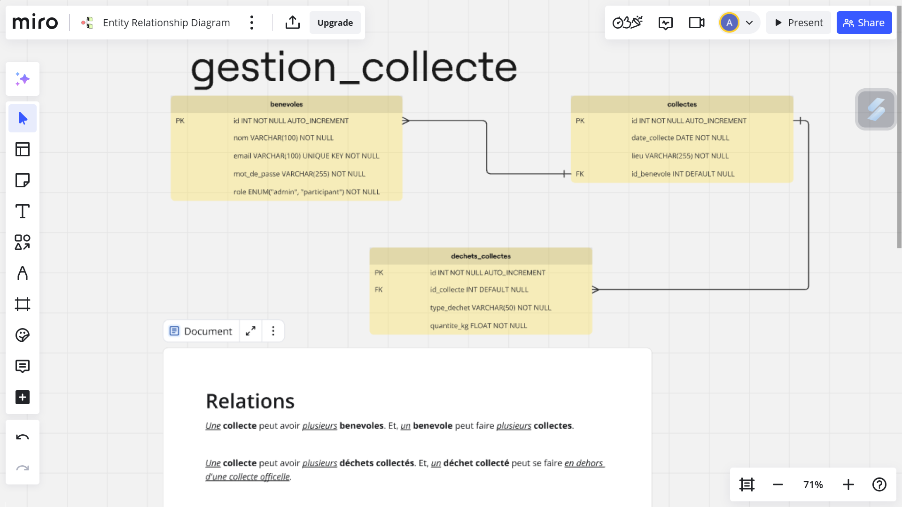

# Projet_Collectif_Template

Ce dépôt Git vous sert de base de travail pour les projets collectifs : en cliquant sur le lien fourni par l'encadrante, celui-ci sera automatiquement copié dans la dépôt que vous créerez pour ce projet.

Il ne vous reste plus qu'à vous lancer sur le projet collectif, et à mettre à jour le dépôt au fil de l'eau !

## Modélisation

## Git Flow

Au début d'une nouvelle fonctionnalité:

1. `git checkout dev`: pour se mettre sur la branch dev
2. `git pull origin`: pour t'assurer que tu es bien à jour sur dev
3. `git branch nom-de-fonctionnalite-dev`: pour travailler sur une nouvelle fonctionnalité

Pendant la réalisation de la fonctionnalité:

4. `git add .`: pour ajouter les fichiers modifiés
5. `git commit -m "message de commit"`: pour commiter les modifications
6. `git push origin nom-de-fonctionnalite-dev`: pour pousser les modifications sur le dépôt

Une fois la fonctionnalité terminée:

- S'il y a pas de conflit, on fait une PR sur l'interface github: 